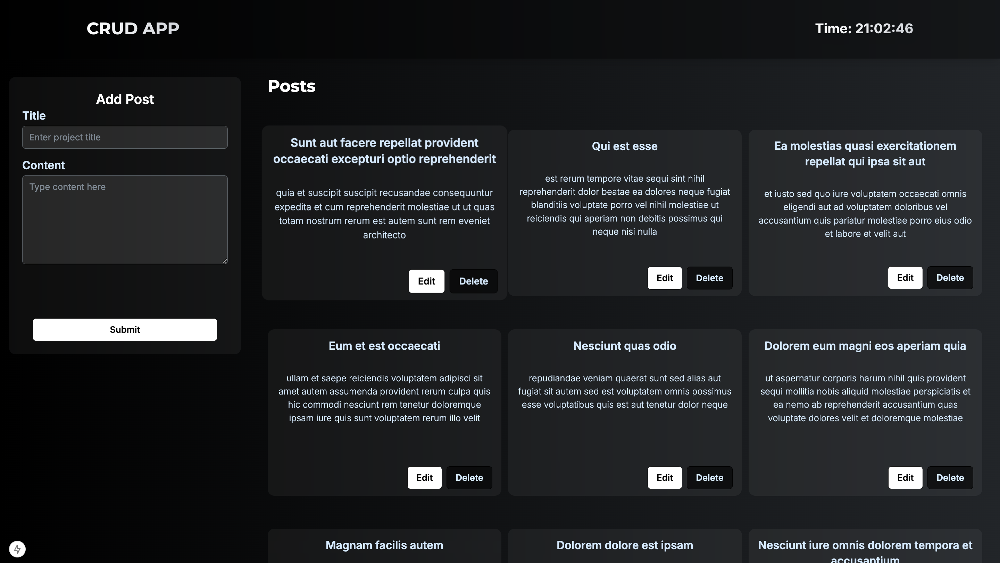
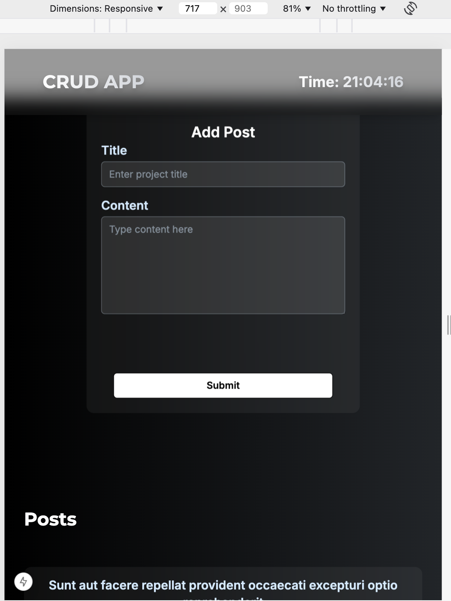

# CRUD Application
 [**Live Demo**](https://cruddaily.vercel.app/)
 
A full-featured CRUD (Create, Read, Update, Delete) application built with Next.js, DaisyUI, React Hook Form, React Query, and Axios. This project demonstrates modern frontend development techniques using a glassmorphic design, responsive layout, and seamless API integration.


## Features

- **Modern UI/UX:**    
  - Smooth transitions and hover effects.  
  - Consistent dark theme with ice-blue accents.
  <a href="assets/UI.png"></a>


- **Responsive Layout:**  
  - Fixed left sidebar for the project form on larger screens.  
  - Designed for users on small screens.
<a href="assets/Responsive.png"></a>

- **CRUD Operations:**  
  - **Create:** Add new posts via a stylish form.  
  - **Read:** Fetch posts from an API and display them.  
  - **Update:** Edit existing posts inline.  
  - **Delete:** Remove posts instantly with live updates.

- **Pagination:**  
  - Custom pagination that displays the current page and the next two pages.
<a href="assets/Pagination.png"></a>


## Technologies Used

- **[Next.js](https://nextjs.org/):**  
  React framework for server-rendered applications.
  
- **[DaisyUI](https://daisyui.com/):**  
  Tailwind CSS component library for building beautiful UI components.
  
- **[React Hook Form](https://react-hook-form.com/):**  
  Simple, performant, and flexible form library for React.
  
- **[React Query](https://react-query.tanstack.com/):**  
  Data-fetching library for managing asynchronous operations and caching.
  
- **[Axios](https://axios-http.com/):**  
  Promise-based HTTP client for making API requests.

## Installation

Follow these steps to set up the project:

### 1. Clone the Repository
```sh
git clone https://github.com/your-repo-url.git
cd your-repo-folder
```

### 2. Install Dependencies

Using npm:
```sh
npm install next daisyui react-hook-form @tanstack/react-query axios
```

Using yarn:
```sh
yarn add next daisyui react-hook-form @tanstack/react-query axios
```

### 3. Running the Application

Using npm:
```sh
npm run dev
```

Using yarn:
```sh
yarn dev
```

The application will now be running at [http://localhost:3000](http://localhost:3000).

## How to Use

1. Add a new post using the form.  
2. Edit an existing post by clicking the edit button.  
3. Delete a post using the delete button.  
4. Navigate through posts using the pagination component.

## Project Structure

```
/src/components   - Contains reusable components like NavBar, PostCard, ProjectForm, Pagination, etc.
/src/api         - Contains API utility functions (e.g., Axios setup and CRUD API calls).
tailwind.config.ts - Tailwind CSS configuration with DaisyUI and custom extensions.

